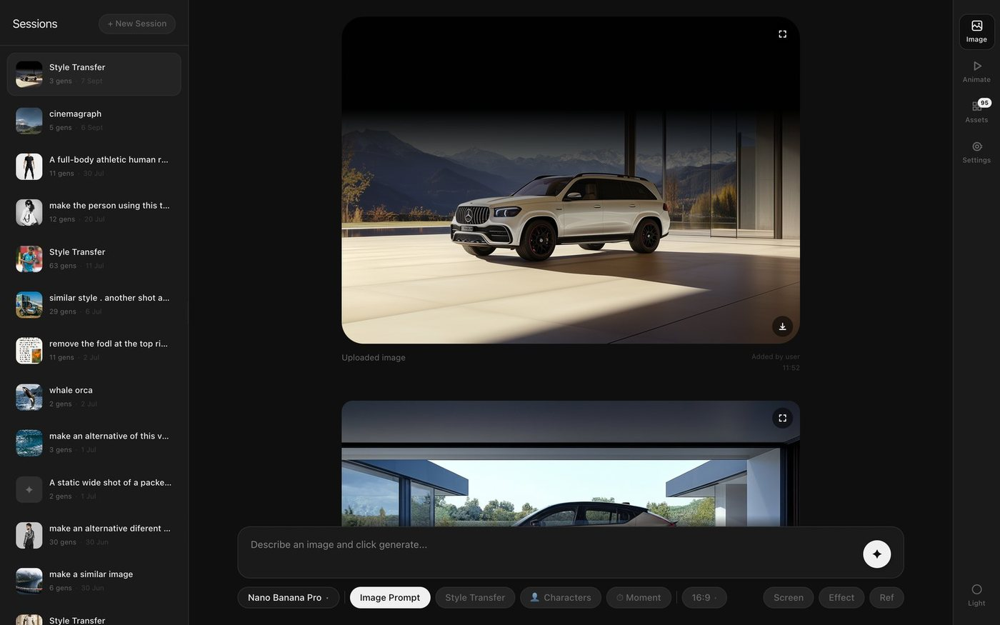
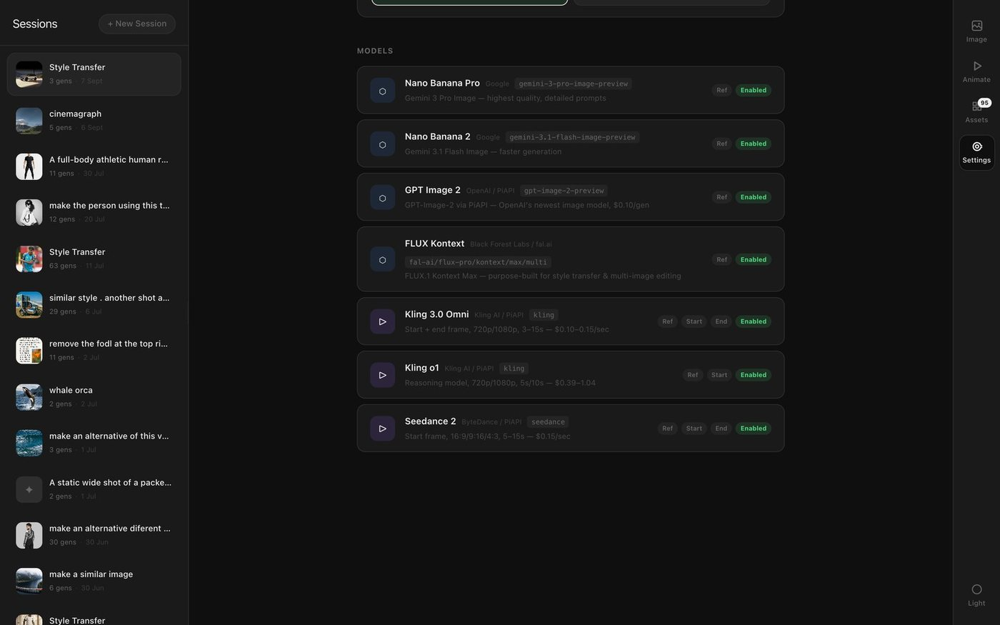
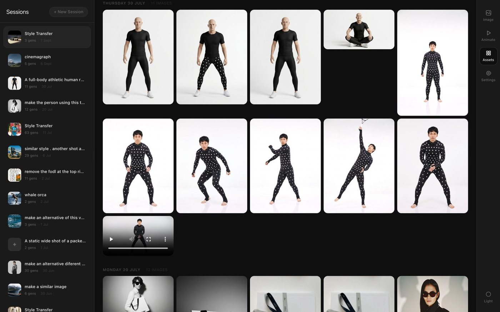

# Sessions

Every image and video model in one window, running on your own machine, with the
work kept as files instead of somebody's account.

One prompt bar, seven models behind it, and a sidebar of every session you have
run. Nothing here is a subscription: each generation goes straight to Google,
PiAPI or fal.ai on your own keys, and what comes back is written to a folder on
your disk.



## Why

The alternative is five tabs. Nano Banana for stills, Kling for motion,
something else for a style transfer — each with its own gallery, its own credits
and its own idea of where your files live. This is the same work with one bar at
the bottom of it, and a picture you made an hour ago can be dragged straight into
the next request.

## Install

```bash
git clone git@github.com:davidbastian/sessions.git
cd sessions && npm install
cp .env.local.example .env.local
npm run dev
```

Next.js 16 and React 19. There is nothing to deploy and nobody to sign up with;
the server it needs is the one on your own machine, and it exists only to keep
the keys out of the browser and write the files to disk.

One key is enough to start:

| Key | Gets you | Where |
| --- | --- | --- |
| `GOOGLE_AI_API_KEY` | Nano Banana Pro and 2, plus the prompt improver | [aistudio.google.com](https://aistudio.google.com/app/apikey) |
| `PIAPI_API_KEY` | Kling, Seedance, GPT Image 2 | [piapi.ai](https://piapi.ai/workspace/api-key) |
| `FAL_API_KEY` | FLUX Kontext | [fal.ai](https://fal.ai/dashboard/keys) |
| `OPENROUTER_API_KEY` | Gemini image models, routed differently | [openrouter.ai](https://openrouter.ai/settings/keys) |

Keys can also be typed into Settings, which writes them to `.env.local`, masks
them afterwards and applies them without a restart. A model whose key is missing
simply says so when you ask it for something.

## Five ways to ask

The bar changes shape rather than the app changing page. Pick a mode and the
slots it needs appear; everything else stays where it was.

| Mode | What it takes |
| --- | --- |
| **Image prompt** | Words, and optionally three slots that change what the words mean: **Ref** for the look, **Effect** for a treatment to apply, **Screen** for what a device in the picture is displaying. |
| **Style transfer** | Two pictures. The second keeps its subject, pose and framing; the first lends everything about how it looks. |
| **Characters** | A scene, and up to five faces to put in it. Two switches decide whether each person keeps their own clothes and their own pose. |
| **Moment** | One frame and a number of seconds — what the same camera saw two seconds before, or five after. |
| **Animate** | A start frame, an end frame, a duration and a resolution. Kling or Seedance draws the seconds in between. |

A mode is not a switch on the model, it is a paragraph written for it. Those
paragraphs live in `app/api/generate-image/route.ts` and are the part worth
reading: Moment works because the instruction lists what must *not* change —
the same faces, the same room, the same light — before it asks for what happens
next.

When a model refuses a photograph of real people, the request is not abandoned:
both images are described in words by a cheaper model and sent again as prose,
with no photograph attached.

## Seven models, one config file



Every model is an entry in `config/models.ts` — what it is called, who bills for
it, which ratios it accepts, whether it takes a reference image, a start frame,
an end frame. The bar, the badges and the routing all read that list, so adding
one is a config change rather than a feature:

```ts
{
  id: 'nano-banana-pro',
  name: 'Nano Banana Pro',
  provider: 'Google',
  type: 'image',
  aspectRatios: ASPECT_RATIOS,
  supportsImageRef: true,
  apiModel: 'gemini-3-pro-image-preview',
  enabled: true,
}
```

Video is the part that costs real money — ten seconds of Kling at 1080p is a
dollar fifty — so the bar works the price out from the duration and resolution
you picked and prints it next to the button before you press it.

## Everything is a file



A generation is not a row in a database. Images are written into
`public/sessions/<id>/` as PNGs, videos are downloaded from the provider before
their link expires, and the index is a JSON file next to them. A session names
itself from its first prompt. Deleting one hides it from the sidebar and keeps
its pictures in Assets, because the thing you regret is never the picture.

Assets is that folder read back: everything ever generated, grouped by day,
filtered by the model that made it. Any tile can be dragged out of the grid and
into a slot in the bar — the reference for the next picture is usually one you
already made.

Your generated work stays out of git. `public/sessions/` and `public/timelines/`
are ignored, and so is every `.env` file.

## Where it stands

A workshop rather than a product: no accounts, no hosting, no credits, nothing to
sign up for. It is a window over the APIs you are already paying for, with the
files kept where you can find them.

There is a timeline built inside it — keyframes on a bar, an image generated at
each one, Kling drawing the clip between them — which works and has no button
yet.
